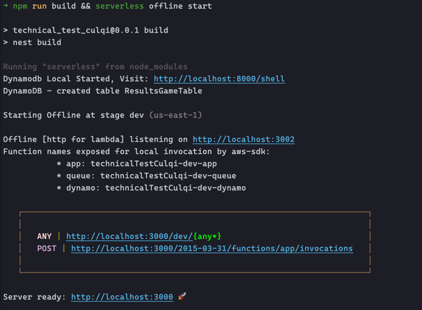
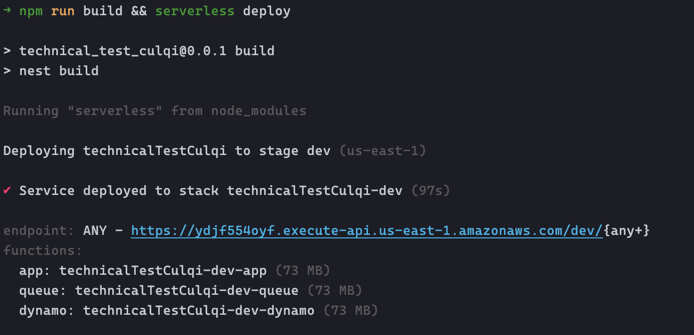

# Documentación de uso

## Requisitos

- Node.js
- Java

## Instalación

Instalar [AWS CLI](https://aws.amazon.com/es/cli/) y luego configurar una cuenta de AWS.

```bash
# Configure sus credenciales:
$ aws configure
# Instalación de Serverless
$ npm install -g serverless
# Instalando dependencias
$ npm install
```

## Ejecución de Serverless

```bash
# Ejecutar en local, Lambdas y DynamoDB
$ npm run build && serverless offline start
```



```bash
# Subir a producción
$ npm run build && serverless deploy
```


## Documentación
Documentación en [Postman](https://documenter.getpostman.com/view/11052226/2s93Xwxi1w)

https://documenter.getpostman.com/view/11052226/2s93Xwxi1w

## Pruebas unitarias
Para ejecutar pruebas ingresar el siguiente comando
```bash
$ npm run test
```
